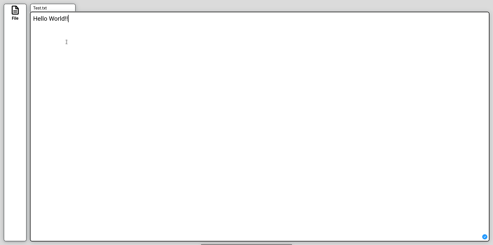
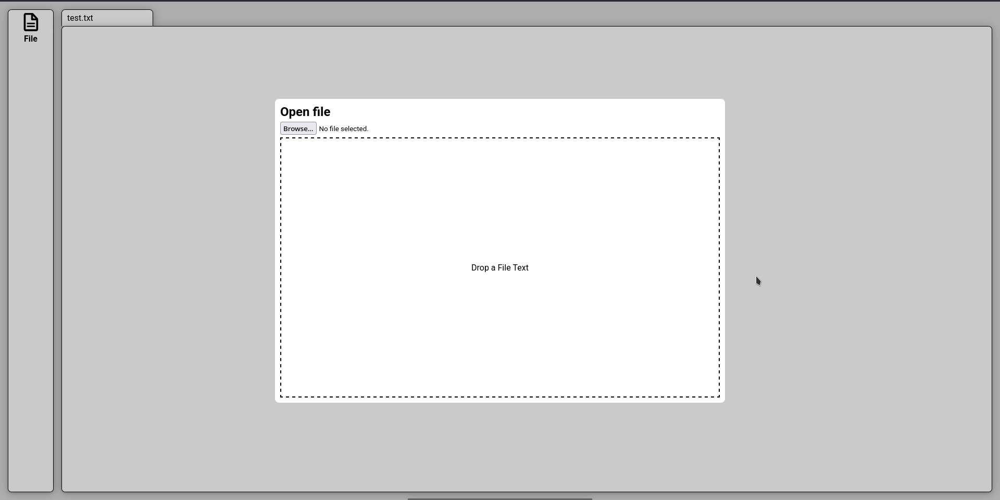
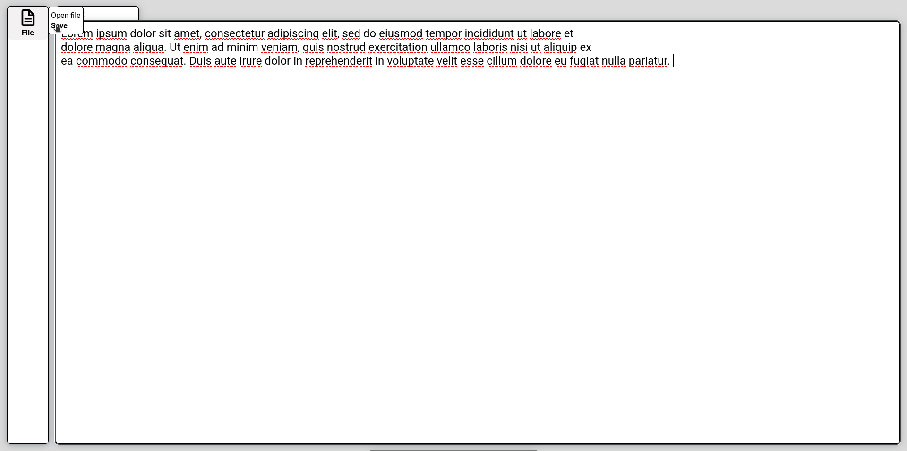

# Text Editor

**Text Editor** is a simple web-based editor that allows you to create, edit, and download text files directly in your browser.

## Features
- Create new text files.
- Edit existing text files.
- Download files to your device.
- Open and load text files from your device.

## Stack
- HTML
- JavaScript
- CSS

## Screenshot

## Demo Link
You can try the app here: [Text Editor Demo](https://ismaelvr1999.github.io/TextEditor/)
